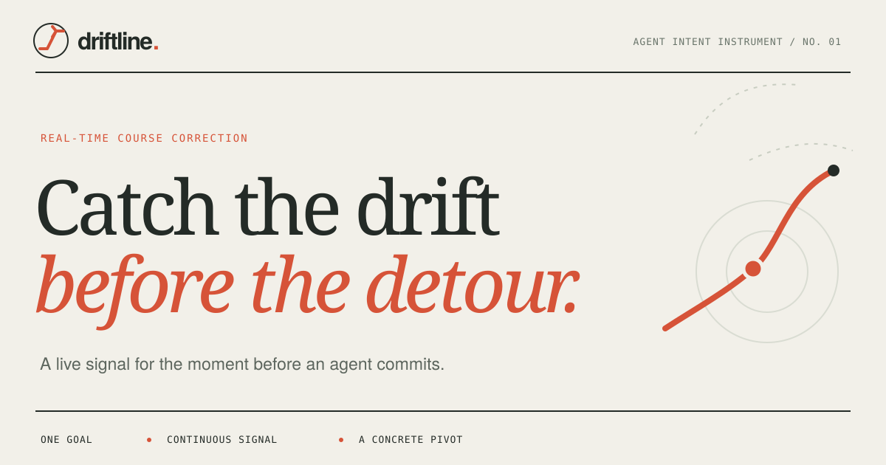

# driftline.



Driftline watches an agent's next action while it is still being written. It scores whether that action serves the current user goal, emits a typed decision, and can send a concrete correction before the action is carried out. The local scorer is written in C++ and runs an int8 ONNX model with SentencePiece tokenization.

The demo runs a real local NLI model. The replays are scripted inputs, but the readings, timings, and decisions come from inference. You can also edit the goal and action live.

## Try it

On an Apple Silicon Mac, install CMake, SentencePiece, and nlohmann JSON. Setup downloads the pinned ONNX Runtime 1.21.0 C++ package and the pinned model files.

```sh
brew install cmake sentencepiece nlohmann-json
npm ci
npm run setup:cpp
npm run dev:cpp
```

Open the local address printed by Vite. Vite passes scoring requests to one persistent native process over newline delimited JSON. The browser displays the result and measures its round trip time. Setup downloads the pinned int8 model of about 90 MB and its SentencePiece tokenizer into `.cache`. Later runs reuse them. No API key is needed.

`npm run dev:fast` keeps the original Node scorer for comparison. `npm run dev` and the static production build use a browser Web Worker so the public GitHub Pages demo runs without a server. The C++ scorer currently runs locally and is not deployed with that static site.

Select one of the three replays to watch an action develop across partial snapshots. Use **Edit live** or **Start from scratch** to score your own text. **Inspect JSON** shows each request, decision, and gate result.

## How it works

```text
current goal + constraints + recent history + partial action
                         ↓
       native C++ process, Node, or browser worker
                         ↓
        local NLI model and signal assembly
                         ↓
           continue | pivot | uncertain
                         ↓
       goal-version and request-ID pivot gate
                         ↓
              simulated agent handoff
```

The scorer combines semantic alignment, drift, contradiction, and whether the text looks like a committed action or a quotation. A small threshold policy turns those model signals into a typed decision. It has no keyword list for specific goals or actions. When evidence is weak or conflicting, it abstains with `uncertain`.

The client coalesces queued partial actions so an old fragment cannot hold up the newest one. Each result carries its goal version and request ID. The gate rejects stale results and sends at most one correction per goal phase. An accepted pivot goes to a redirect callback during model generation or a steer callback during a tool action. The workbench uses a simulated callback and does not control an external agent.

The output contract includes `kind`, `confidence`, `driftScore`, `adjustment`, `latencyMs`, `goalVersion`, `requestId`, `evidence`, and the underlying `signals`. A pivot includes a plain instruction to pause, return to the user's goal, respect its constraints, and ask before changing the objective. Other decisions have a null adjustment.

`confidence` is a heuristic decision-support score derived from model outputs. `driftScore` is the stronger of the drift and contradiction signals. Neither is a calibrated probability.

## Verify

```sh
npm test
npm run eval
npm run eval:cpp
npm run build
```

The unit tests cover typed decisions and stale-result handling. The JS evaluation runs 16 hand-labeled scenarios with 37 partial-action snapshots against the same local model used by the demo. The C++ evaluation scores the same corpus, compares decisions with the JS path, and measures warm native process round trips. The evaluation notes are in [evals/README.md](evals/README.md).

This corpus is a regression set, not a representative accuracy study. It includes quoted instructions, negated actions, adjacent subtasks, explicit constraint violations, and incomplete fragments. Do not interpret its precision or recall as production performance.

On September 23, 2026, both scorers detected 5 of 10 labeled pivots with no false pivots among 27 other snapshots. The C++ and JS decisions matched on all 37 snapshots. One native run measured warm process round trips over 200 sequential mixed inputs at 59.3 ms p50, 95.9 ms p95, and 117.5 ms p99. A separate JS run measured 193.2 ms p50, 350.0 ms p95, and 528.2 ms p99. An earlier JS run measured 35.3 ms p50. The machine had high background load during the newer runs, so these figures do not establish a speed advantage. Timings exclude browser rendering and model download. Run the commands above on your own hardware.

## Current limits

- The scorer missed half the labeled pivots in this small regression set. It can miss a real pivot when an action contains both relevant and conflicting language. The gate only redirects on a high-confidence pivot.
- Scores are uncalibrated. Thresholds need a larger, independent dataset before use in an autonomous agent.
- The C++ process still uses a model whose inference time dominates scoring. C++ alone does not make this a microsecond system. The model download dominates first use. The native mode is a local development server, not a deployed inference service.
- The native tokenizer and sentence splitting have been compared on the regression corpus, but arbitrary Unicode, abbreviations, and long truncated inputs can differ from the JavaScript path.
- The demo sink shows the exact correction that would be sent, but it does not interrupt a live model or tool call.

Driftline uses [`Xenova/nli-deberta-v3-xsmall`](https://huggingface.co/Xenova/nli-deberta-v3-xsmall) pinned to a model revision through [Transformers.js](https://huggingface.co/docs/transformers.js/v3.8.1/en/api/pipelines). The underlying model is [`cross-encoder/nli-deberta-v3-xsmall`](https://huggingface.co/cross-encoder/nli-deberta-v3-xsmall). [Agent Trajectory Sentinel](https://arxiv.org/abs/2608.02464) is related work on completed-step telemetry monitoring. Driftline scores the semantics of partial action text and does not reuse that paper's latency or detection claims.
